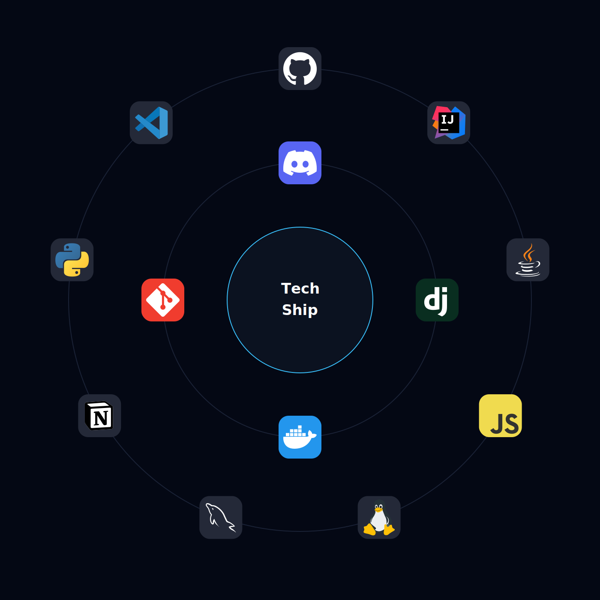

<p align="center">
  
</p>

<p align="center">
  
</p>

---

# Hi, I'm Lakshya

```text
┌────────────────────────────────────────────────────────────┐
│                 ZERO PROGRAMMING MISSION LOG               │
├────────────────────────────────────────────────────────────┤
│ ROLE      : Computer Science Student                       │
│ STATUS    : Learning                                       │
│ OBJECTIVE : Build AI Systems                               │
│ METHOD    : Build → Break → Understand → Repeat            │
└────────────────────────────────────────────────────────────┘
```

---

## About Me

I'm a computer science student focused on **core software engineering**, **problem-solving**, and **building practical systems**.

I prefer understanding fundamentals deeply before moving to abstractions.

<p align="center">
  
</p>

---

## Current Mission

```yaml
PRIMARY_TARGET:
  - Data Structures & Algorithms

SECONDARY_TARGET:
  - Backend Engineering

ACTIVE_RESEARCH:
  - AI Systems
  - LLM Internals
  - RAG Systems

CURRENT_STATUS:
  - Still Learning
  - Still Building
```

---

## Featured Projects

### Code Analyzer

<a href="https://github.com/2204Zero/Code_analyzer_stable">
  
</a>

Built using:

* Python
* Ollama
* RAG

Focus:

* Document-based querying
* Context awareness
* Local AI integration
* AI system design

---

### Java Console Management System

```text
STACK:
Java + MySQL

FEATURES:
CRUD Operations
Database Integration
Structured Data Handling

FOCUS:
Backend Logic
Database Fundamentals
```

---

## Technology Constellation

<p align="center">
  
</p>

---

## GitHub Telemetry

<p align="center">
  
  
</p>

<p align="center">
  
</p>

---

## Achievement Matrix

<p align="center">
  
</p>

---

## Activity Grid

<p align="center">
  
</p>

---

## Long-Term Trajectory

```text
Earth
 │
 ├─ Programming
 │
 ├─ Software Engineering
 │
 ├─ Backend Systems
 │
 ├─ AI Systems
 │
 ├─ LLMs
 │
 └─ ZERO AI
```

---

## Contact

Email: [lakshyagoyal701@gmail.com](mailto:lakshyagoyal701@gmail.com)

---

> Build things. Break them. Understand why they broke.
